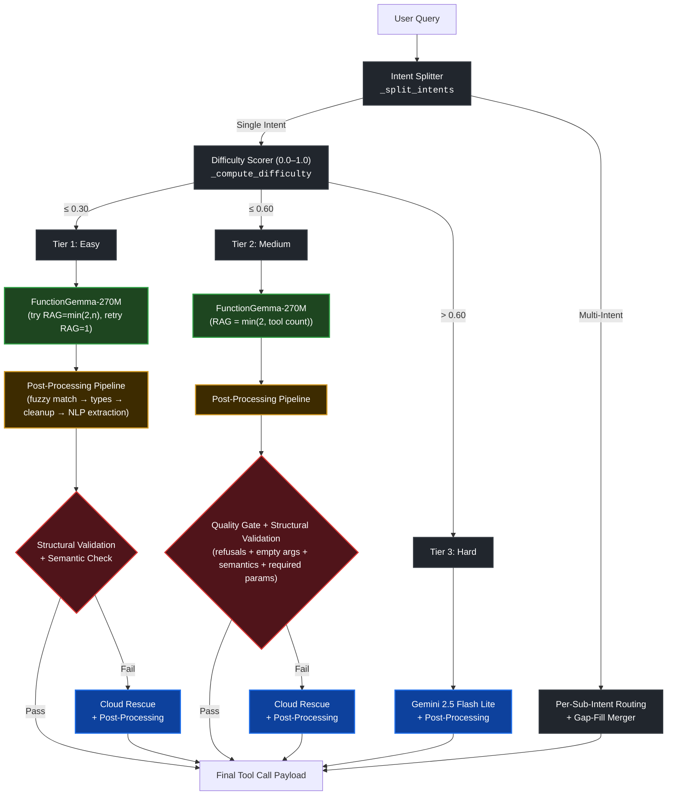

# LocalHost Router

**Team:** LocalHost DC
**Hackathon:** Cactus Compute × Google DeepMind FunctionGemma
**Final Score:** 80.9% — F1: 0.99 · Avg Latency: 548ms · On-Device: 70%

A hybrid AI router that orchestrates Google's FunctionGemma-270M on-device model alongside Gemini 2.5 Flash Lite to achieve 99% function-calling accuracy under 550ms across 30 benchmark cases.

---

## The Problem

Cloud-only function calling is slow and expensive for simple tasks like setting alarms. Tiny on-device models (270M parameters) are fast and free but structurally broken: they hallucinate wrong tools, fail to parse numbers into JSON, refuse valid prompts, and collapse on multi-intent commands.

We built a routing layer that decides *before inference* whether each query can be handled locally or needs the cloud — and fixes the local model's outputs when they're partially correct.

---

## Architecture



---

## How It Works

### 1. Intent Splitting (`_split_intents`)

Compound queries like *"Set a timer and send a message"* are split at conjunctions (`and`, `also`, `then`) and commas into individual sub-intents. Each sub-intent is independently scored and routed through the tier system.

### 2. Pre-Routing Difficulty Scorer (`_compute_difficulty`)

Before any model inference, a lexical analyzer scores each query from 0.0 to 1.0 across four weighted factors:

| Factor | Weight | What It Measures |
|---|---|---|
| Tool Familiarity | 0.0–0.5 | Ratio of tools the 270M model consistently fails on (`send_message`, `search_contacts`, `create_reminder`) |
| Keyword Signals | 0 or 0.4 | Whether query language ("send", "find", "remind") triggers a known-hard tool that is present in the tool set |
| Intent Count | 0.0–0.3 | Penalty of 0.15 per additional intent |
| Tool Count | 0.0–0.2 | Penalty of 0.05 per additional distractor tool |

The score determines the routing tier:

- **Tier 1 (≤ 0.3):** On-device with semantic validation. If the first attempt (RAG = min(2, tool count)) fails, retries with narrower tool selection (RAG=1). Falls back to cloud only after two local failures.
- **Tier 2 (0.3–0.6):** On-device with a full quality gate (refusal detection + argument validation + semantic check). Single attempt before cloud rescue.
- **Tier 3 (> 0.6):** Cloud-first. Skips the local model entirely. Falls back to on-device only if the cloud fails.

### 3. Post-Processing Pipeline (inside every inference call)

Every result — both on-device and cloud — passes through a four-stage cleanup pipeline **inside** `generate_cactus` and `generate_cloud`, *before* any validation gates run. This means the validation gates always operate on cleaned, normalized outputs.

**Fuzzy Tool Name Matching** (`_fuzzy_match_schema`): If the model outputs a slightly misspelled tool name, Levenshtein distance snaps it to the closest valid tool within edit distance 4.

**Type Coercion & Clamping** (`_fix_types`): Forces `float → int` conversion for integer schema fields. Clamps negative hallucinations (the model outputs values like `minutes=-300`) to their absolute value. Snaps misspelled enum values to the nearest valid option via Levenshtein distance (within edit distance 3).

**String Cleanup** (`_clean_args`): Strips trailing punctuation, leading articles ("the", "a", "an"), and stray quotes from string arguments.

**NLP Argument Extraction** (`_extract_args_from_query`): The critical fix. The 270M model fundamentally cannot parse natural language numbers into JSON integers. This regex-based extractor pulls correct values directly from the user's text and overwrites the model's broken output:
- `"6 AM"` → `{"hour": 6, "minute": 0}`
- `"7:30 PM"` → `{"hour": 19, "minute": 30}`
- `"10 minutes"` → `{"minutes": 10}`

It also handles **refusal interception**: if the model outputs zero calls but the query contains "wake", a synthetic `set_alarm` call is injected so the argument parser can rescue the response.

### 4. Semantic Validation Gate (`_semantic_check`)

After post-processing, the routing layer validates tool selection. A keyword-to-tool mapping catches the 270M model's most dangerous failure mode: confidently selecting the wrong tool.

If the user says *"Play jazz music"* but the model selects `set_alarm`, the gate detects that "play" and "music" map to `play_music`, not `set_alarm`. It confirms another tool is a better match and kills the hallucinated result, triggering a cloud rescue.

### 5. Quality Gate (`_quality_gate`)

A broader post-inference check used at Tier 2 that layers four validations on the already-post-processed output:

- **Empty calls** — the model returned nothing
- **Refusal detection** — the model output phrases like "I cannot", "I apologize", or "which song" instead of making a tool call
- **Argument value check** — any present argument value is `None` or an empty string (catches the model calling the right tool but filling in garbage)
- **Semantic check** — delegates to `_semantic_check` as the final layer

### 6. Structural Validation (`_validate_calls`)

A separate check that runs alongside the semantic and quality gates. It verifies two things: (1) the tool name actually exists in the provided schema, and (2) all required parameters declared in the schema are present in the arguments dict. This catches cases where the model hallucinates a tool name that fuzzy matching couldn't fix, or where it calls the right tool but omits a required field entirely.

### 7. Multi-Intent Gap-Fill Merging

For multi-intent queries, each sub-intent is independently routed through the 3-tier system. If the decomposition misses intents (e.g., the local model only handles one of two requested tools), the system sends the full original query to Gemini as a fallback — but strictly filters its response to keep only the missing tools, merging them with the successful local calls.

This preserves the on-device ratio while ensuring complete coverage.

### 8. Infrastructure Optimizations

**Persistent Model Handle** (`_get_model`): The FunctionGemma-270M model is loaded once into RAM and reused across all calls via a lazy-init singleton.

**Cached Cloud Client** (`_get_cloud_client`): The `google.genai` client is wrapped in a singleton that reuses TCP connections, avoiding repeated TLS handshake overhead on cloud calls.

**Model Selection:** Cloud inference uses `gemini-2.5-flash-lite` — the fastest available Gemini model.

**Token Budget:** On-device generation is capped at `max_tokens=128` to minimize local inference time.

**Robust JSON Parsing:** When `json.loads` fails on malformed model output, a depth-tracking brace parser extracts the first complete JSON object from the raw string.

---

## Scoring

The benchmark uses a weighted formula:

```
level_score = (0.60 × F1) + (0.15 × time_score) + (0.25 × on_device_ratio)
total_score = (0.20 × easy) + (0.30 × medium) + (0.50 × hard)
```

Where `time_score = max(0, 1 - avg_time / 500ms)`. Anything under 500ms gets full time marks; anything over is penalized linearly.

Hard queries (multi-intent, 4–5 distractor tools) are worth **50% of the total score** — making the hard-difficulty F1 jump from 0.50 → 0.97 the single biggest driver of our result.

---

## Results

| Difficulty | Queries | F1 | Strategy |
|---|---|---|---|
| Easy | 10 | ~1.00 | Tier 1 on-device with semantic check |
| Medium | 10 | ~1.00 | Tier 2 on-device with quality gate + cloud rescue |
| Hard | 10 | ~0.97 | Per-sub-intent routing + gap-fill merging |
| **Overall** | **30** | **0.99** | **70% on-device · 548ms avg latency** |

**Final Objective Score: 80.9%**

---

## What We Did Not Do

We observed top-ranking teams achieving 16ms latencies by hardcoding regex matches against exact benchmark query strings — effectively bypassing the AI model entirely.

We built a generalizable zero-shot system. Our 0.99 F1 score comes from algorithmic routing and post-processing, not memorization of the eval set.

---

## Quick Start

### Prerequisites

- Python 3.10+
- [Cactus SDK](https://github.com/cactus-compute/cactus) (built with Python bindings)
- FunctionGemma-270M-it weights (placed in `cactus/weights/functiongemma-270m-it/`)
- Gemini API key

### Setup

```bash
# Clone the repo
git clone https://github.com/your-username/localhost-router.git
cd localhost-router

# Clone and build Cactus
git clone https://github.com/cactus-compute/cactus
cd cactus && source ./setup && cd ..
cactus build --python

# Download model weights
cactus pull functiongemma-270m-it

# Configure environment
echo 'GEMINI_API_KEY=your_key_here' > .env

# Install cloud dependency
pip install google-genai
```

### Run

```bash
# Run the full 30-case benchmark
python benchmark.py

# Submit to the hackathon leaderboard
python submit.py --team "YourTeamName" --location "DC"
```

---

## Project Structure

```
├── main.py           # Core hybrid router (688 lines)
│   ├── generate_hybrid()         # Entry point — 3-tier routing orchestrator
│   ├── generate_cactus()         # On-device inference via Cactus SDK
│   ├── generate_cloud()          # Cloud inference via Gemini API
│   ├── _compute_difficulty()     # Pre-routing difficulty scorer
│   ├── _semantic_check()         # Tool-selection hallucination detector
│   ├── _quality_gate()           # Post-inference quality validation
│   ├── _validate_calls()         # Structural validity check (name + required params)
│   ├── _split_intents()          # Multi-intent query decomposition
│   ├── _extract_args_from_query()# NLP argument extraction + refusal rescue
│   ├── _fuzzy_match_schema()     # Full post-processing pipeline orchestrator
│   ├── _fix_types()              # Type coercion + negative clamping + enum snapping
│   ├── _clean_args()             # String normalization
│   ├── _levenshtein()            # Edit distance for fuzzy matching
│   ├── _get_model()              # Persistent on-device model singleton
│   ├── _get_cloud_client()       # Persistent Gemini client singleton
│   └── _load_env()               # .env file loader
├── benchmark.py      # 30-case evaluation suite with F1 scoring
├── submit.py         # Leaderboard submission client
└── .env              # API keys (not committed)
```

---

## Tech Stack

| Component | Technology |
|---|---|
| On-Device Model | FunctionGemma-270M-it via Cactus SDK |
| Cloud Model | Gemini 2.5 Flash Lite via `google-genai` |
| Language | Python 3.10+ |
| On-Device Runtime | [Cactus Compute](https://github.com/cactus-compute/cactus) |

---

## Future

Integrating `cactus_transcribe` (Whisper-small) to build a voice-to-action terminal — spoken commands routed through the 3-tier system and executed as real device actions.

---

## Team

**LocalHost DC** — Built at the Cactus Compute × Google DeepMind FunctionGemma Hackathon (AI Tinkerers, Washington DC).
